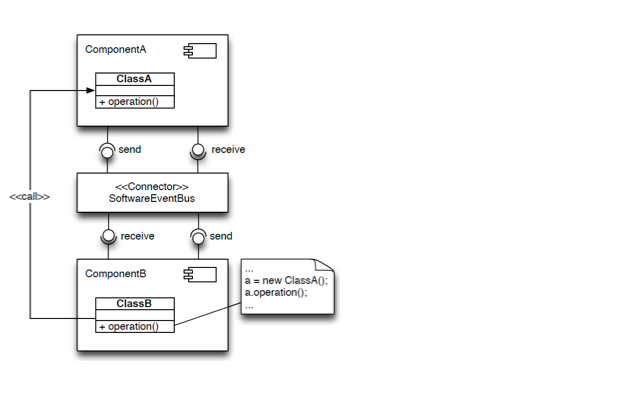
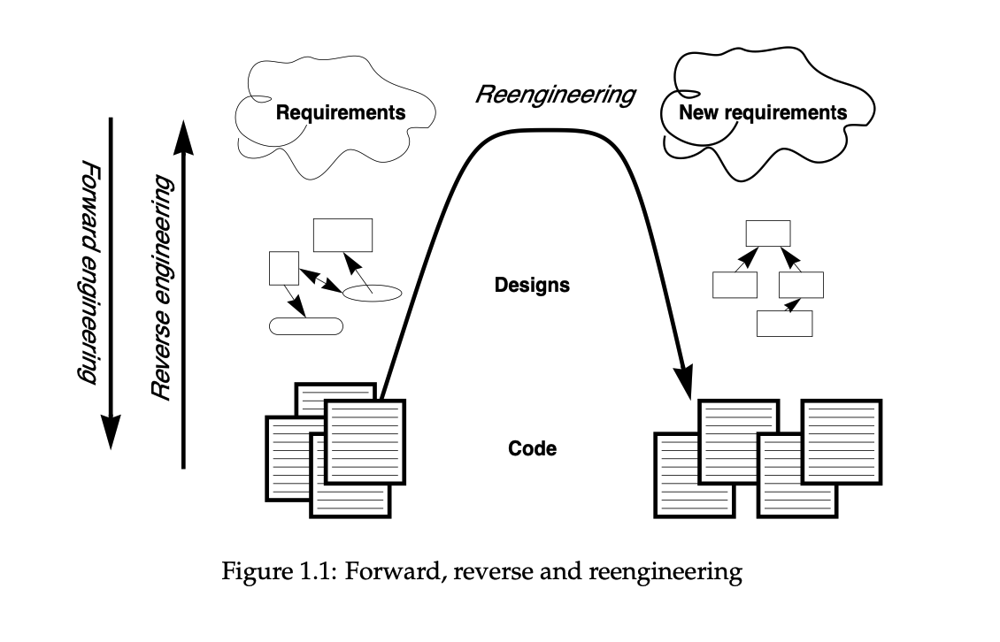

IT University of Copenhagen

# Software Architecture Reconstruction: Introduction

Mircea Lungu

<a href="https://github.com/mircealungu/reconstruction">github.com/mircealungu/reconstruction</a>

## Meta

This and following three lectures
 - Are material that you don't find in the SAiP textbook
 - Is going to be very practical
 - Will give you the chance to do a bit of coding for program analysis
 - The basis for your individual report
 - Have inspired several of your colleagues to choose thesis projects
 
 
Feedback & Questions
- [Anonymous form](https://forms.gle/ADWfDZdKfPwdFG1D6)
- Email: mlun@itu.dk
- PR on the  [.md version of the slides on GH](https://github.com/mircealungu/itu-architecture-reconstruction/blob/master/lectures/Reconstruction_1_Lecture_10.md) if you see bugs

## Imagine ... 

- Onboarding on a new system
- Buying a software company
- Having to do 
	- a risk assessment for security
	- an architectural evaluation

Q:  What would be nice to have in all these circumstances but we almost never have?

## What is the first thing you do when you buy a software company? 

[link to original tweet](https://twitter.com/elonmusk/status/1593899029531803649)

Even paying 50B for a company does not guarantee that you get architectural diagrams with the source code. 

A: (to question above) **Up to date architectural documentation**.

## Discussion

Have you seen architectural documentation for every system?

- No, *Why is it missing?* 
- Yes? 
	- Is it up to date? 
	- *No? Why not?* 
 

## Why does architectural documentation become out of sync with system?

 - Hard to maintain 

 - Link (traceability ) between architecture and code is not easy to establish

 - Often there is no perceived value for the customer (or more likely, no clear immediate value)

 - Because developers make decisions and changes 
	 - that are not aligned with the original vision => **[architectural drift](https://youtu.be/hExflmcBSc4?t=14)**
	 - that go against prescriptive architecture => **[architectural erosion](https://youtu.be/hExflmcBSc4?t=70)**

## Architecture Erosion Example

What could be the cause of erosion here?

Why would it be a problem?

## How to Keep Architectural Documentation up to Date?

1 / **Enforcing architectural constraints** 
- special DSLs and tools for architecture constraints definition (e.g. [Dictō](https://scg.unibe.ch/archive/papers/Cara14b-Dicto.pdf))
- some are implemented as Unit Tests  (e.g. [ArchUnit](https://www.archunit.org/use-cases))
- pre-commit hooks? somebody should do a study! (<- Thesis idea)

--

2 / **Generating architectural diagrams from code**
- as opposed to drawing them in Powerpoint
- we'll see techniques for doing this
- no sufficiently good tools for this (<- Thesis idea)

--

3 / **Reconstructing the Architecture**
- and ideally follow up with one of the previous two

# Architecture Reconstruction (AR)

a.k.a: *architecture recovery* (the two are used interchangeably)

(def.) **A reverse engineering approach that aims at reconstructing viable architectural views of
a software application** [1]

- reverse engineering?

 [1] Ducasse & Pollet, [Software Architecture Reconstruction:
a Process-Oriented Taxonomy](https://rmod.inria.fr/archives/papers/Duca09c-TSE-SOAArchitectureExtraction.pdf)

## Reverse Engineering

**(def.)** the process of analyzing a subject system to identify the system’s components and their interrelationships and create representations of the system in another form or at a higher level of abstraction. (Demeyer et al., [Object Oriented Reengineering Patterns](http://scg.unibe.ch/download/oorp/OORP.pdf), Chapter 1.2)

Focus on 
- components 
- relationships
- higher level of abstraction

Relation with architecture recovery? They are overlapping activities and use overlapping methods.

## Reverse Engineering vs. Reengineering?

“Reengineering is the **examination and alteration** of a subject system to reconstitute it in a new form” (Demeyer et al., [Object Oriented Reengineering Patterns](http://scg.unibe.ch/download/oorp/OORP.pdf), Chapter 1.2)

? Relation with AR? 
AR could be a possible first step in reengineering

# How To Do Architecture Reconstruction?

[Symphony: View-Driven Software Architecture Reconstruction](https://ipa.win.tue.nl/archive/springdays2005/Deursen1.pdf)
- Classical, principled way
- View-driven approach
- Distinguishes between three kinds of *views*
    1. **Source** 
	     - view extracted directly from artifacts of a system
	     - not necessarily architectural (e.g. see later example)
    2. **Target**  
	     - describes architecture-as-implemented
	     - any of the 3+1 views
    3. **Hypothetical** 
	     - architecture-as-designed
	     - existing documentation
	     - presentations

## Symphony Stages: Design (blue) & Execution (yellow)

### Desgin: Problem elicitation
- “Business case” for reconstruction
- What is the problem? 

### Design: Concept determination

- What architectural information is needed to solve the problem?
- **Which viewpoints are relevant?**

### Execution: Data gathering
 - Collecting and extracting low-level source views
 - Can involve a multitude of sources
 

### Execution: Knowledge inference
 - Going from source to target views
 - Abstracting low-level information

### Execution: Information interpretation 
 - Visual representation
 - Analysis, creating new documentation

## Data Gathering: Interactive Case Study

Example: [Google Collab with Basic Data Gathering](https://colab.research.google.com/drive/1oe_TV7936Zmmzbbgq8rzqFpxYPX7SQHP#scrollTo=0ruTtX88Tb-w)
Or, *why source viewpoints are not necessarily architectural?*

# Individual Assignment

## Goal
- **Recover the architecture of an existing system**

- Document the outcome in an **individual report**
	- brief (not more than 3 -- 5 pages)
	- do not explain to us what Symphony does in the report; you assume it's done
	- focus on your results
	- the target reader is a developer, who needs to take over that system and maintain it

## Case-Study Systems

1. The Zeeguu Project 
	- [Online Deployment](https://zeeguu.com) (invite code: zeeguu-usability)
	- Code:
		- Python Backend: [Zeeguu-API](https://github.com/zeeguu/API)
		- React Frontend: [Zeeguu-Web](https://github.com/zeeguu/web) 
	- A [paper](https://github.com/zeeguu-ecosystem/CHI18-Paper/blob/master/!AsWeMayStudy--Preprint.pdf) about the system

or, 

2. Another system that you know
	- if it has comparable complexity (>200 files)
	- you confirm with me about the appropriateness of the system

## Viewpoints

1. Module Viewpoint (**default**)
	- we will write example code snippets in collab to support this
	- makes the most sense for the Zeeguu system

2. Other Viewpoints
	- you could look at the execution or deployment information
	- might make more sense for another system - the Zeeguu one is too simple (could be done together with the module)

## Tools 
- Are important for recovery

- **If you can program**, then this is your chance to be coding **analysis tools** over the upcoming lectures
  - you can still code as a team! you only have to write the analysis on your own

- **If you can't program**, then you'll have to find third party tools (the time the programming ones spend on programming, you'll be spending on finding third party tools) 

# For Next Week

  
## Reading
- [Symphony: View-Driven Software Architecture Reconstruction](https://ipa.win.tue.nl/archive/springdays2005/Deursen1.pdf)
- [Demeyer et al., Object Oriented Reengineering Patterns](http://scg.unibe.ch/download/oorp/OORP.pdf) (Chapter 1.2)
  
## Practice & Think About
- [Google Collab with Basic Data Gathering](https://colab.research.google.com/drive/1oe_TV7936Zmmzbbgq8rzqFpxYPX7SQHP#scrollTo=0ruTtX88Tb-w)
	- Understand the code
	- Think about techniques for "abstracting" this information
- Can you find equivalent off-the shelf tools?

## Questions & Feedback
- Use the anonymous [form](https://forms.gle/ADWfDZdKfPwdFG1D6)
- Or the forum if it's of general interest