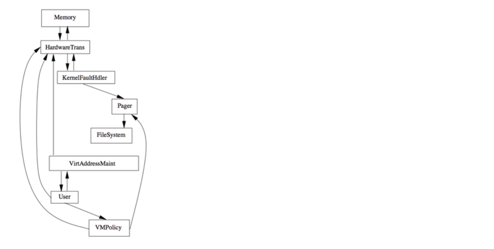
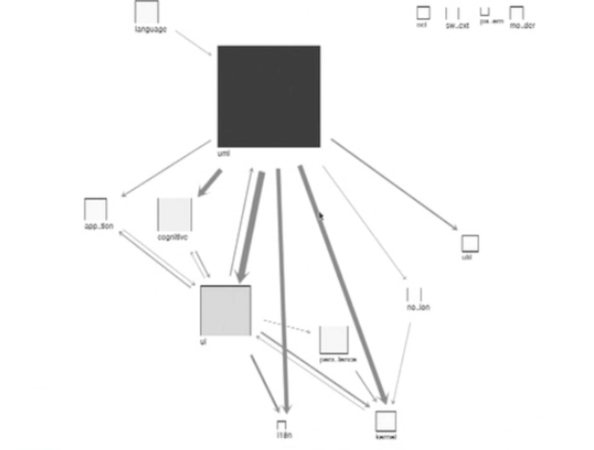
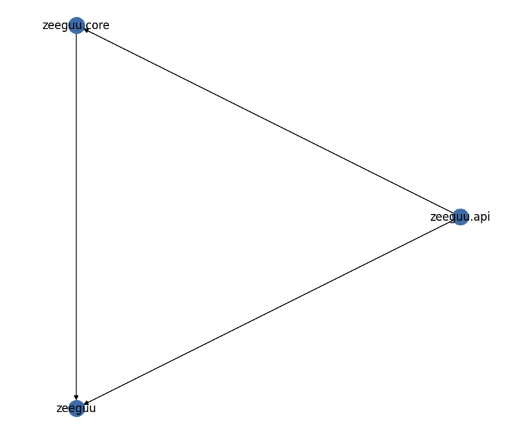

IT University of Copenhagen

# Software Architecture Reconstruction: Abstraction

Assoc. Prof. Mircea Lungu

mlun@itu.dk

<a href="https://github.com/mircealungu/reconstruction">github.com/mircealungu/reconstruction</a>

### The *source view* obtained last time

- **System**: Zeeguu-API
- **Source View**: Modules & Dependencies
- **Entities**: .py files in the project
- **Relationships**: import statements between .py files

## Refining the source view to simplify it?

*Starting from the [Basic Data Gathering](https://colab.research.google.com/drive/1oe_TV7936Zmmzbbgq8rzqFpxYPX7SQHP?usp=sharing) notebook...*
 
**1/ Add labels to the nodes. Do you see irellevant nodes?**

--

- the view shows dependencies to external modules
- if goal is understanding *this system's structure* ... are they needed?

--

2/ **Filter out the non-system dependencies** *(approx. all that don't start with `zeeguu`)* **Does the graph look better?**

--
- Lesson: filtering is an important tool for AR

--

**2 / Let's try another [layout from networkx](https://networkx.org/documentation/stable/reference/drawing.html) (e.g. [draw_kamada_kawai](https://en.wikipedia.org/wiki/Force-directed_graph_drawing)**). Can you spot  other irellevant modules?

--
- tests are also not very relevant
- Lesson: layouts are important 

-- 
**3 / Filter out tests**. **Does the view look cleaner?** 

--

*What else can we do here to simplify?*

# Knowledge Inference / Abstraction

[Symphony...](./papers/deursen-symphony.pdf) (Sec. 6.2): "The reconstructor creates the target view by ...
- **condensing the low-level details ** of the source view, and 
- **abstracting them** into architectural information.

"[...] domain knowledge is used to **define a map between the source and target view**." 

???

> This activity may require either interviewing the system experts in order to formal- ize architecturally-relevant aspects not available in the im- plementation or to iteratively augment the source view by adding new concepts to the source viewpoint
>
> -- Symphony, 6.2

## Approach #1: Mapping Using Naming Conventions 

[..] **if the mapping contains a rule about using naming conventions to combine classes into modules**, the resulting map lists each class and the module to which it belongs."

### Reflexion Model

= an architectural viewpoint that indicates **where the source model and high-level model differ**

1. Convergences
1. Divergences
1. Absences

Obtaining it is an **iterative process**

    Repeat
    1. Define/Update high-level model of interest
    2. Extract a source model
    3. Define/Update declarative mapping between high- level model and source model
    4. Reflexion model computed by system
    5. Interpret the software reflexion model.
    Until “happy”

From:  [Software Reflexion Models: Bridging the Gap ...](./papers/murphy-reflexion.pdf)

#### Case Study

In [**Software Reflexion Models: Bridging the Gap between Design and Implementation**](./papers/murphy-reflexion.pdf) *Murphy et al.*: 
- Ask Linux maintainers to 

	1. draw dependencies between subsystems (*as-expected* architecture)
	2. provide mappings from file names to subsystems

- Recover the *[as-implemented](https://youtu.be/E6N8TuqPU6o?t=30)* *module view*

- Compare the *as-implemented* architecture with the *as-expected* architecture 

##### Step 1.a. Maintainers draw dependencies between subsystems

From:  [Software Reflexion Models: Bridging the Gap ...](./papers/murphy-reflexion.pdf)

##### Step 1.b. Maintainers provide mappings from file names to subsystems

From:  [Software Reflexion Models: Bridging the Gap...](./papers/murphy-reflexion.pdf)

##### Step 2. Comparing the As-Implemented and the As-Expected Dependencies

From:  [Software Reflexion Models: Bridging the Gap ...](./papers/murphy-reflexion.pdf)

## Approach #2: Using the Folder Hierarchy for Aggregation

Developers hierarchically organize files in folders. *Let us use that!* 
1. Aggregate nodes
2. Aggregate dependencies
3. Show the aggregated dependencies & nodes

Advantages
1. Works for most languages & most systems!
2. Can be used in a MSc thesis :) (e.g. [topic1](https://github.com/mircealungu/student-projects/issues/4), [topic2](https://github.com/mircealungu/student-projects/issues/35)) 

### Example from ArgoUML

Two types of dependencies:
1. Explicit
2. Implicit

From: [Evolutionary and Collaborative Software Architecture Recovery with Softwarenaut,](https://core.ac.uk/download/pdf/33045731.pdf) by Lungu et al.

### Basic Implementation in Python

Code: [Basic Abstraction](https://colab.research.google.com/drive/1ohvPB_SZeDa5NblzxLAkwmTY8JZRBZe_?usp=sharing)

## Approach #3: Using Metrics for Abstraction

A software [metric](https://www.javatpoint.com/software-engineering-software-metrics) is a **measure of software characteristics** which are measurable or countable

Types of metrics:
1. Product - measure the resulting product, e.g. source code
2. Process - measure the process, e.g. frequency of change

Q: *So how is this a complementary tool?*

--

Remember the def of architecture: **"[...] modules, their properties, and the relationships between them"**

--

*A: Metrics can express these "properties".*

### Product metrics

For **Files/Methods**
- **Cyclomatic Complexity** (aggregated from file level)
	- CYCLO - Cyclomatic Complexity ([wiki](https://en.wikipedia.org/wiki/Cyclomatic_complexity)) 
	    - number of linearly independent code paths through source code (functions of the number of branches)
	    - often used in quality: too much complexity is a bad thing
	    - hidden partially by polymorphism

For **Modules**
- **Size** (Aggregated from file level)
	- LOC - lines of code 
	- NOM - number of methods

For **Dependencies**
- **Total count** of explicit low-level dependencies
- **Number of distinct** explicit low-level dependencies 

### Augmenting Recovered Views with Metrics

Useful in top-down interactive exploration, e.g. Softwarenaut ([video](https://vimeo.com/62767181), [paper](https://core.ac.uk/download/pdf/33045731.pdf))

e.g., Augmeting nodes and dependencies with metrics in ArgoUML packages with a *polymetric view* 

Coding Assignment: Compute size metrics, and map them on the nodes in your module view at the end of the [Abstraction](https://colab.research.google.com/drive/1ohvPB_SZeDa5NblzxLAkwmTY8JZRBZe_?usp=sharing) notebook

## Approach #4 (research!): Keep Only the Most Essential Elements Based on Network Analysis

e.g. Paper: [Ranking software artifacts](http://scg.unibe.ch/archive/papers/Peri10bRankingSoftware.pdf). by Perin, Renggli, and Ressia
- Use the PageRank algorithm of Google
- Abstracts by filtering out the less relevant nodes

Consider trying it out in your project if you're interested in network analysis!

`networkx` supports various methods of network analysis, e.g. [centrality](https://networkx.org/documentation/stable/reference/algorithms/centrality.html#degree), [HITS](https://networkx.org/documentation/stable/reference/algorithms/generated/networkx.algorithms.link_analysis.hits_alg.hits.html), [pagerank](https://networkx.org/documentation/stable/reference/algorithms/generated/networkx.algorithms.link_analysis.pagerank_alg.pagerank.html)

???

- Automatic Clustering
     - has been tried with 
       - coupling cohesion
       - natural language analysis
     - even in the case of clustering we still need human intervention

## Note: Importance of Understanding Dependencies in Architecture Reconstruction

AR helps us to *tell a story* about the system. 

To tell a story one needs:
  - subjects - the modules in the view
  - actions - the dependencies in the view 

In your project aim to describe also the reason for the dependencies (at least the most essential ones)

## To Think About

- Mapping metrics on visualizations helps make sense of the data

- Semi-automatic (~*automation with human in the loop*) solutions are always required in Architecture Reconstruction

- The difference between the views recovered today and a hand-drawn UML diagram? 
  - what we created today is always telling the truth (*live diagrams*)
  - but, **maybe not all the truth?**

# Personalizing your Project

- Can you complete the implementation of the import extractor with the missing part? 
- Can you visualize also dependency metrics with networkx? E.g. a stronger dependency as a thicker arrow? 
- Consider using `pyvis` instead of `networkx` -- it has much nicer visualizations!
- Consider [exporting the data from networkx](https://networkx.github.io/documentation/stable/reference/drawing.html) into specialized graph visualization tools 

**To Do: start working on your project! Don't leave it all for the last moment!** 

