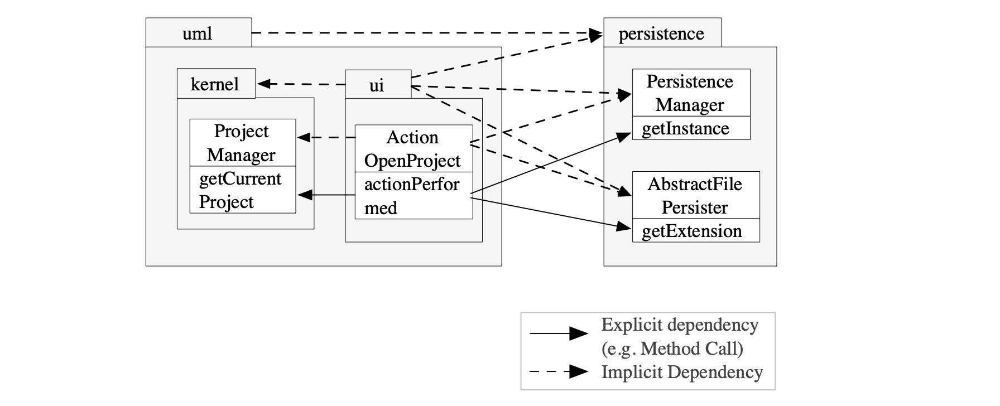
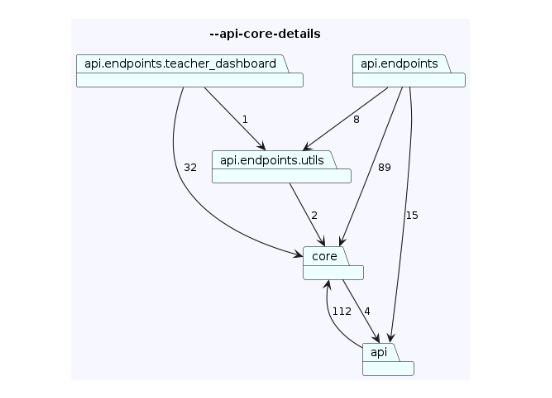
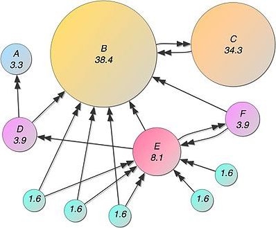
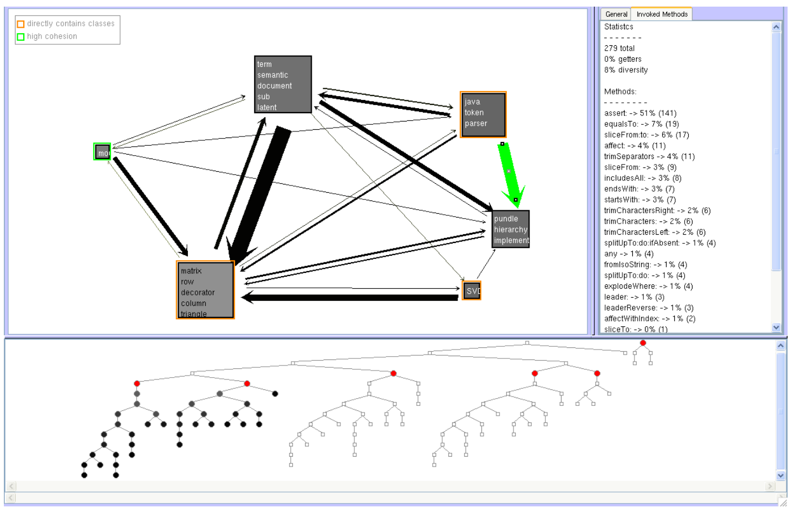

IT University of Copenhagen

# Software Architecture Reconstruction: Abstraction

<a href="https://github.com/mircealungu/reconstruction">github.com/mircealungu/reconstruction</a>


Mircea Lungu
mlun@itu.dk

### The *source view* obtained last time... 
... is beautiful... isn't it?


- **System**: [zeeguu/api](https://github.com/zeeguu/api) 
- **Source View**: Modules & Dependencies
- **Entities**: .py files in the project
- **Relationships**: import statements between .py files

(*Image from the [Basic Data Gathering](https://colab.research.google.com/drive/1oe_TV7936Zmmzbbgq8rzqFpxYPX7SQHP?usp=sharing) notebook*)

## What can we can do to simplify the source view?

 
**1/ Remove irrelevant nodes?**

- the view shows dependencies to external modules. if goal is understanding *this system's structure* ... are they needed?
	- Discuss: how to we define *external* modules?  

- Notebook activity: [**Filter out the non-system dependencies]([Basic Abstraction](https://colab.research.google.com/drive/1ohvPB_SZeDa5NblzxLAkwmTY8JZRBZe_?usp=sharing). Does the graph look better? 
- Conclusion: filtering is a useful *tool* in AR


**2 / Try different [layouts](https://en.wikipedia.org/wiki/Force-directed_graph_drawing#History? 

Notebook activity: try the [draw_kamada_kawai](https://en.wikipedia.org/wiki/Force-directed_graph_drawing)  [layout from networkx](https://networkx.org/documentation/stable/reference/drawing.html) 
- Lesson: layouts can make a difference


# Knowledge Inference / Abstraction

[Symphony...](./papers/deursen-symphony.pdf) (Sec. 6.2): "The reconstructor creates the target view by ...

- **condensing the low-level details ** of the source view, and 
- **abstracting them** into architectural information.


"[...] domain knowledge is used to **define a map between the source and target view**." 


> This activity may require either interviewing the system experts in order to formal- ize architecturally-relevant aspects not available in the implementation or to iteratively augment the source view by adding new concepts to the source viewpoint
>
> -- Symphony, 6.2


## Approach #1: Using the Folder Hierarchy

Hierarchies are powerful. We organize societies in them. And we organize software systems in them. 

### Exemplifying with a few classes from ArgoUML

Based on containment relationships we can: 
1. Aggregate nodes
2. Aggregate dependencies 

The following image presents a few classes and packages from the FOSS project ArgoUML



Figure shows that we can distinguish between
1. **Explicit dependencies**
	- method call
	- import
	- subclassing 
2. **Implicit aggregated dependencies** (because there are other kinds of implicit dependencies we will see next time)

### Aggregation can be done at multiple abstraction levels

Notebook: [Basic Abstraction: Exploring aggregation levels. ](https://colab.research.google.com/drive/1ohvPB_SZeDa5NblzxLAkwmTY8JZRBZe_?usp=sharing). 

Conclusion: you can not know upfront to what level to aggregate. So it is good to be able to explore various levels. 

It might be that **different modules need to be explored at different levels**. From [ArchLens](https://github.com/archlens/ArchLens), a project started in the MSc thesis of two of your colleagues: 

```json
     "api-core-details": {
        "packages": [
            {"packagePath":"api", "depth":2},
            {"packagePath":"core", "depth":0}
        ],
        "ignorePackages": ["*test*"]

```


### Different views can tell complementary stories about a system

It might even that one needs to apply the *divide and conquer* approach to split the complexity of a system's architecture in multiple, more manageable perspectives.

```json
    "views": {
    
        "topLevel": {
             "packages": [
                {"packagePath":"", "depth":0}
            ],
            "ignorePackages": []
        },
        
	     "api-core-details": {
	        "packages": [
	            {"packagePath":"api", "depth":2},
	            {"packagePath":"core", "depth":0}
	        ],
	        "ignorePackages": ["*test*"]    
	}
```




### Pros and Cons of Folder-Based Aggregation

Pros: 
1. Works for many languages & systems
2. Can be used in a MSc thesis :) (e.g. [topic1](https://github.com/mircealungu/student-projects/issues/4), [topic2](https://github.com/mircealungu/student-projects/issues/35)) 

Cons:
- Some languages don't use the folder structure the same way: C# has folders vary independent from namespaces. There you have to analyze namespaces. 
- COBOL does not have a folder structure at all. Smalltalk also does not. 


## Approach #2: Using Metrics 

A software [metric](https://www.javatpoint.com/software-engineering-software-metrics) is a **measure of software characteristics** which are measurable or countable

Types of metrics:
1. Product - measure the resulting product, e.g. source code
2. Process - measure the process, e.g. frequency of change

*So how is this a complementary tool?* 

Remember the def of architecture: **"[...] modules, their properties, and the relationships between them"**

Metrics can express these *"properties"*.


### Product metrics that can be aggregated from files to higher level abstractions 

Almost anything. The only choice is: how do you aggregate? Do you sum? Do you average? It depends on the question you are asking.

For **Files/Methods**
- **Cyclomatic Complexity** ([wiki](https://en.wikipedia.org/wiki/Cyclomatic_complexity)) 
	- number of linearly independent code paths through source code (functions of the number of branches)
	- often used in quality: too much complexity is a bad thing
	- hidden partially by polymorphism

For **Modules**
- **Size** 
	- LOC - lines of code 
	- NOM - number of methods

For **Dependencies**
- **Total count** of explicit low-level dependencies
- **Number of distinct** explicit low-level dependencies 


### Augmenting Recovered Views with Metrics

One approach would be an interactive top-down exploration approach combined with metrics is  Softwarenaut ([video](https://vimeo.com/62767181)) described in [Evolutionary and Collaborative Software Architecture Recovery with Softwarenaut,](https://core.ac.uk/download/pdf/33045731.pdf) by Lungu et al.


Figure: Augmeting nodes and dependencies with metrics in ArgoUML packages.


## Approach #3: Detecting Essentials With Network Analysis

The PageRank algorithm that made Google famous tries to gauge the importance of a page in a network of pages based on the references pages make to each other. 


Visual intuition about PageRank ranking (Image source: [spatial-lang.org](https://spatial-lang.org/pagerank)).

In the paper [Ranking software artifacts](http://scg.unibe.ch/archive/papers/Peri10bRankingSoftware.pdf) Perin et al. applied the PR algorithm in order to attempt to detect the most relevant elements in a software system.

*Note:* Consider trying it out in your project if you're interested in network analysis! It should not be that hard, the `networkx` package supports various methods of network analysis, e.g. [centrality](https://networkx.org/documentation/stable/reference/algorithms/centrality.html#degree), [HITS](https://networkx.org/documentation/stable/reference/algorithms/generated/networkx.algorithms.link_analysis.hits_alg.hits.html), [pagerank](https://networkx.org/documentation/stable/reference/algorithms/generated/networkx.algorithms.link_analysis.pagerank_alg.pagerank.html).


## Approach #4 - Automatic Clustering

What if we did unsupervised learning? We could do hierarchical clustering of the system for example. Then, we could hope that the clusters are mapped on architectural components. 

Automatic clustering has been tried with 
   - coupling and cohesion metrics
   - natural language analysis
   - other types of similarity between programming units

In all of the cases we still need human intervention to explore the result of the automatically detected clusters. 

Case study: [Interactive Exploration of Semantic Clusters](papers/Interactive_Exploration_of_Semantic_Clus.pdf) by Lungu et al. 




# Reflexion Models

Introduced in [**Software Reflexion Models: Bridging the Gap between Design and Implementation**](./papers/murphy-reflexion.pdf) *Murphy et al.* which: 

- Ask Linux maintainers to 
	1. draw dependencies between subsystems (*as-expected* architecture)
	2. provide mappings from file names to subsystems

- Recover the *[as-implemented](https://youtu.be/E6N8TuqPU6o?t=30)* *module view*

- Compare the *as-implemented* architecture with the *as-expected* architecture 


## Step 1.a. Maintainers draw dependencies between subsystems


Note: All images in this section are from the [Software Reflexion Models: Bridging the Gap ...](./papers/murphy-reflexion.pdf) paper. 

## Step 1.b. Maintainers provide mappings from file names to subsystems


## Step 2. Comparing the As-Implemented and the As-Expected Dependencies


Obtaining a reflection model is an **iterative process**: 

```
Repeat
	1. Define/Update high-level model of interest
	2. Extract a source model
	3. Define/Update declarative mapping between high- level model and source model
	4. Reflexion model computed by system
	5. Interpret the software reflexion model.
Until “happy”
```

## Definition 

Reflection model = an architectural viewpoint that indicates **where the source model and high-level model differ**

1. Convergences
2. Divergences
3. Absences


# To Think About

- In which way does mapping metrics on visualizations help make sense of the data

- Why are semi-automatic solutions (~*automation with human in the loop*) always required in Architecture Reconstruction?

- What is the difference between the views recovered today and a hand-drawn UML diagram or something drawn on the whiteboard? 

- How do you explain a recovered architectural view? Do you need to explain the role of the nodes? Should you also explain the reason for the existence of the dependencies between them? 

- Could we use ... LLMs?

- Are there other abstractions that we didn't discuss about? What could they be? 

# Personalizing your Project

- Can you visualize also dependency metrics with networkx? E.g. a stronger dependency as a thicker arrow as in the Softwarenaut examples?

- For the aestheticians: consider using `pyvis` instead of `networkx` -- it has much nicer visualizations!

- Consider [exporting the data from networkx](https://networkx.github.io/documentation/stable/reference/drawing.html) into specialized graph visualization tools (e.g. cytoscape, etc.)

- Compute size metrics, and map them on the nodes in your module view

- Can you also *recommend architectural improvements*? 

- Do you have access to the developers such that you can recover a reflection model viewpoint of the system?

**Advice: Start working on your project! Don't leave it all for the last moment!** 


