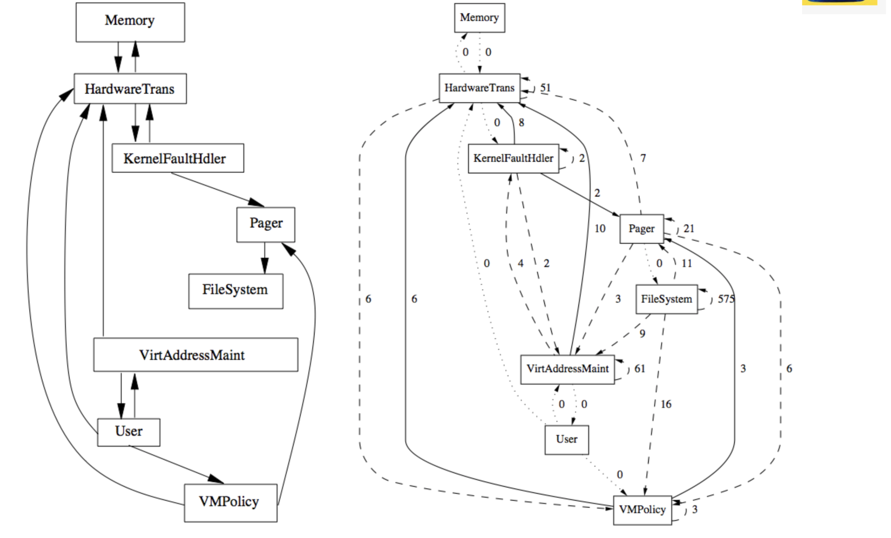
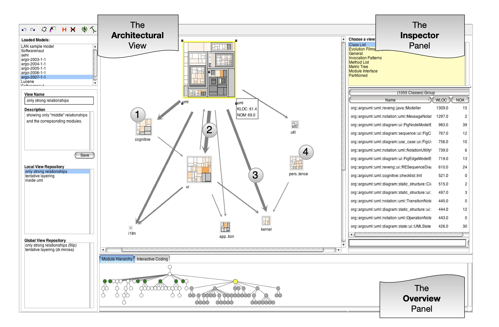

class: center, middle

IT University of Copenhagen

#### Software Architecture

###  Session #10

# Reconstruction (II): Abstraction

Assoc. Prof. Mircea Lungu

mlun@itu.dk

---

### The *source view* obtained last time

- **System**: Zeeguu-API
- **Source View**: Modules & Dependencies
- **Entities**: .py files in the project
- **Relationships**: import statements between .py files

---
## Refining the source view to simplify it?

*Starting from the [Basic Data Gathering](https://colab.research.google.com/drive/1oe_TV7936Zmmzbbgq8rzqFpxYPX7SQHP?usp=sharing) notebook...*
 
**1/ 👨‍💻 Add labels to the nodes. Do you see irellevant nodes?**

--

- the view shows dependencies to external modules
- if goal is understanding *this system's structure* ... are they needed?

--

2/ 👨‍💻 **Filter out the non-system dependencies** *(approx. all that don't start with `zeeguu`)* **Does the graph look better?**

--
- Lesson: filtering is an important tool for AR

--

**2 / 👨‍💻 Let's try another [layout from networkx](https://networkx.org/documentation/stable/reference/drawing.html) (e.g. [draw_kamada_kawai](https://en.wikipedia.org/wiki/Force-directed_graph_drawing)**). Can you spot  other irellevant modules?

--
- tests are also not very relevant
- Lesson: layouts are important 

-- 
**3 / 👨‍💻 Filter out tests**. **Does the view look cleaner?** 

--

*What else can we do here to simplify?*

---
# Knowledge Inference / Abstraction

[Symphony...](./papers/deursen-symphony.pdf) (Sec. 6.2): "The reconstructor creates the target view by ...
- **condensing the low-level details ** of the source view, and 
- **abstracting them** into architectural information.

"[...] domain knowledge is used to **define a map between the source and target view**." 

???

> This activity may require either interviewing the system experts in order to formal- ize architecturally-relevant aspects not available in the im- plementation or to iteratively augment the source view by adding new concepts to the source viewpoint
>
> -- Symphony, 6.2

---

## Approach #1: Mapping Using Naming Conventions 

[..] **if the mapping contains a rule about using naming conventions to combine classes into modules**, the resulting map lists each class and the module to which it belongs."

--

Case Study: [**Software Reflexion Models: Bridging the Gap between Design and Implementation**](./papers/murphy-reflexion.pdf), *Murphy et al.*
- Ask Linux maintainers to 

	1. draw dependencies between subsystems (*as-expected* architecture)
	2. provide mappings from file names to subsystems

- Recover the *[as-implemented](https://youtu.be/E6N8TuqPU6o?t=30)* *module view*

- Compare the *as-implemented* architecture with the *as-expected* architecture 

---

### Step 1.a. Maintainers draw dependencies between subsystems

From:  [Software Reflexion Models: Bridging the Gap ...](./papers/murphy-reflexion.pdf)

---

### Step 1.b. Maintainers provide mappings from file names to subsystems

From:  [Software Reflexion Models: Bridging the Gap...](./papers/murphy-reflexion.pdf)

---

### Step 2. Comparing the As-Implemented and the As-Expected Dependencies

From:  [Software Reflexion Models: Bridging the Gap ...](./papers/murphy-reflexion.pdf)

---

# Reflexion Model

= an architectural viewpoint that indicates **where the source model and high-level model differ**

1. Convergences
1. Divergences
1. Absences

Obtaining it is an **iterative process**

    Repeat
    1. Define/Update high-level model of interest
    2. Extract a source model
    3. Define/Update declarative mapping between high- level model and source model
    4. Reflexion model computed by system
    5. Interpret the software reflexion model.
    Until “happy”

From:  [Software Reflexion Models: Bridging the Gap ...](./papers/murphy-reflexion.pdf)

---
## Approach #2: Using the Folder Hierarchy for Aggregation

Developers hierarchically organize files in folders. *Let us use that!* 
1. Aggregate nodes
2. Aggregate dependencies
3. Show the aggregated dependencies & nodes

Advantages
1. Works for most languages & most systems!
2. Can be used in a MSc thesis :) (e.g. [topic1](https://github.com/mircealungu/student-projects/issues/4), [topic2](https://github.com/mircealungu/student-projects/issues/35)) 

---

## Approach #2 - Example from ArgoUML

Two types of dependencies:
1. Explicit
2. Implicit

From: [Evolutionary and Collaborative Software Architecture Recovery with Softwarenaut,](https://core.ac.uk/download/pdf/33045731.pdf) by Lungu et al.

---

## Approach #2 - Basic Implementation in Python

👨‍💻 Code: [Basic Abstraction](https://colab.research.google.com/drive/1ohvPB_SZeDa5NblzxLAkwmTY8JZRBZe_?usp=sharing)

---

## Complementary Tool: Software Metrics

A software [metric](https://www.javatpoint.com/software-engineering-software-metrics) is a **measure of software characteristics** which are measurable or countable

Types of metrics:
1. Product - measure the resulting product, e.g. source code
2. Process - measure the process, e.g. frequency of change

Q: *So how is this a complementary tool?*

--

Remember the def of architecture: **"[...] modules, their properties, and the relationships between them"**

--

*A: Metrics can express these "properties".*

---

### Product metrics

For **Files/Methods**
- **Cyclomatic Complexity** (aggregated from file level)
	- CYCLO - Cyclomatic Complexity ([wiki](https://en.wikipedia.org/wiki/Cyclomatic_complexity)) 
	    - number of linearly independent code paths through source code (functions of the number of branches)
	    - often used in quality: too much complexity is a bad thing
	    - hidden partially by polymorphism

For **Modules**
- **Size** (Aggregated from file level)
	- LOC - lines of code 
	- NOM - number of methods

For **Dependencies**
- **Total count** of explicit low-level dependencies
- **Number of distinct** explicit low-level dependencies 

---

## Augmenting Recovered Views with Metrics

Useful in top-down interactive exploration, e.g. Softwarenaut ([video](https://vimeo.com/62767181), [paper](https://core.ac.uk/download/pdf/33045731.pdf))

👨‍💻 Code: [Notebook in Collab](https://colab.research.google.com/drive/1IPPZytBD8ralYyTfofX_46DelXg2YF38#scrollTo=h6smbfIlcggm)

---

## Approach #3: Network Analysis

e.g. Paper: [Ranking software artifacts](http://scg.unibe.ch/archive/papers/Peri10bRankingSoftware.pdf). by Perin, Renggli, and Ressia
- Use the PageRank algorithm of Google
- Abstracts by filtering out the less relevant nodes

Consider trying it out in your project if you're interested in network analysis!

`networkx` supports various methods of network analysis, e.g. [centrality](https://networkx.org/documentation/stable/reference/algorithms/centrality.html#degree), [HITS](https://networkx.org/documentation/stable/reference/algorithms/generated/networkx.algorithms.link_analysis.hits_alg.hits.html), [pagerank](https://networkx.org/documentation/stable/reference/algorithms/generated/networkx.algorithms.link_analysis.pagerank_alg.pagerank.html)

???

- Automatic Clustering
     - has been tried with 
       - coupling cohesion
       - natural language analysis
     - even in the case of clustering we still need human intervention

---

## Importance of Dependencies

*To tell a story* we need subjects and actions

To tell the story of a module view we need
  - subjects - the modules in the view
  - actions - the meanings of the dependencies

In your project aim to describe also the reason for the dependencies (at least the most essential ones)

---

## To Think About

- Mapping metrics on visualizations helps make sense of the data

- Semi-automatic solutions are always required in AR

- The difference between the views recovered today and a hand-drawn UML diagram? 
  - what we created today is always telling the truth
  - but, **maybe not all the truth?**

---

## Programming Challenges

  - Can you visualize also dependency metrics with networkx? E.g. a stronger dependency as a thicker arrow? 
  - Consider using `pyvis` instead of `networkx` -- it has much nicer visualizations!
  - Consider [exporting the data from networkx](https://networkx.github.io/documentation/stable/reference/drawing.html) into specialized graph visualization tools 

**To Do: start working on your project! Don't leave it all for the last moment!** 

---

# Backmatter

## What are the limitations of our relationship extraction?

--

- Missing Details
- Imprecisely Extracted

*Why?* 

---

### Missing Details

Other relationships that are more precise exist between the elements of the system
- Inheritance between classes
- Implementation of interfaces
- Method call
- The *cardinality of the relationship is not clear*
	- one import might be used 100 times in the file
	- another one might not be used at all

A special kind of dependency: logical coupling.

---

### Imprecisely Extracted
- Even imports are too imprecisely extracted
- What if an import is in a comment
- What if it is inside of a method
- What if it is inside of a commented out method?

*Why?*  

Because of the limitations of regular expressions.

*Solution?*

Parsing. 

---

## Parsing Source Code

  
- basic component in compiler technology: a.k.a. semantic analysis
- a precise way of **extracting** information from source code (vs. RE)

Approaches
- manual: e.g. PEGs (Parsing Expression Grammars)
- parser generators (Bison, Antlr, etc.)
  

In general, a complicated business 
- See: A Few Billion LOC Later
- use a language specific parsing library (e.g. `ast` package in Python)

---

## Parse Tree

- Full representation of the structure of a program
- Includes whitespace (e.g., EOL): empty boxes in  the figure
  

---

## AST = Abstract Syntax Tree

- Minimal representation of the meaning of the program
- Nodes correspond to constructs in the language
- Enables: inspection, modification and program transformation

  

---

## In Python: the `ast` package

- `ast` package ([docs](https://docs.python.org/3/library/ast.html)) is part of the standard language distribution
- similar packages in other languages
- tree of nodes representing syntactic constructs
- nodes are instances of ast.AST
 

---

### AST nodes

Have two types of attributes:

- attributes (properties)

- lineno, col_offset

- fields (subnodes)

- One of 5 types: identifier, int, string, object, bool

---

### Visiting an AST

  

The Visitor design pattern strikes back :)

- Your class should subclass `ast.NodeVisitor`

- `NodeVisitor` subclasses traverse an AST

- Traversal is depth-first, preorder

- i.e. first node, then children

- You become involved by defining visit_<nodetype> methods

	- Visit your chidren, or define `generic_visit`
	
	- generic_visit calls visit() on all children of the node.

- Note: child nodes of nodes that have a custom visitor method won’t be visited unless the visitor calls generic_visit() or visits them itself.

  
- visit lets you *skip* subtrees
	- if you don't call generic_visit the visitor will not recurse in the current node
	- can be convenient for expediency

---

# Backmatter

Today: 
- [Basic Abstraction / Knowledge Inference](Basic_Abstraction.ipynb)
- [Advanced Extraction: Parsing and ASTs](Advanced_Dependency_Extraction.ipynb)
- [Individual Project Description](https://docs.google.com/document/d/10bTyUS4ZocReS3j2AxHak_-rBh_Yv_0NM6XDQrt0YkY/edit#)
- Sneak peek at snippets from last year's reports

For Next Time
- Choose a system for yor case study
  - start familiarizing yourself with the system
    - [read all the code in one hour](https://eng.libretexts.org/Bookshelves/Computer_Science/Book%3A_Object-Oriented_Reengineering_Patterns_(Demeyer_Ducasse_and_Nierstrasz)/03%3A_First_Contact/3.03%3A_Read_all_the_Code_in_One_Hour)
    - download the code; can you make it run locally?
  - you should at least know what the system does before trying to recover it's architecture
  

- If your system is a Python system start applying the scripts of today on it
  - Consider applying them on [Zeeguu-API](https://github.com/zeeguu-ecosystem/Zeeguu-API) 
    - you'll have to make a few changes to the code though
    - Should be doable even if you don't have much programming skills (or?)
    - Submit [anonymous questions](https://docs.google.com/forms/d/e/1FAIpQLSeAyKO1WUYn9W9-ZN3UrPU2ScEkI0a6fKZsNMHmtuLUb6RHAg/viewform) or post on Teams if you encounter any problems 

- If you're a programmer: try implementing some of the programming challenges [for abstraction](Basic_Abstraction.ipynb#Programming-Challenges) and [extraction](Advanced_Dependency_Extraction.ipynb#Programming-Challenge)
- If you're not a programmer: start looking for tools that you'd like to use and start evaluating them

