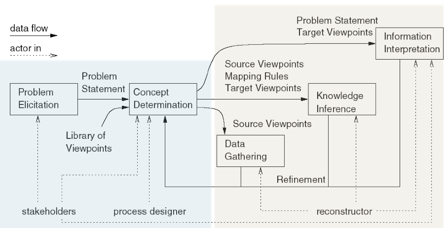

# Problem: Too much low-level information


Zeeguu-Core (on the right)
- 194 `.py` files
- 13.354 LOC
- import statements


It's a small system 
  - A larger system would look even less readable
  - Explains *software aging*: easy to lose track of *the big picture*
  - Explains the need for visualization


## Observations


    
Some files belong more together (bottom cluster)
  - ? *Coupling or Cohesion* ? 
  - Could we automatically detect classes that belong together?
    
An interactive tool would help a bit
  - mouse over and see the individual file names
  - filter + group


# Knowledge Inference / Abstraction




>  The reconstructor creates the target view by **condensing the low-level details of the source view** and **abstracting them into architectural information**. 
>
> The mapping rules and domain knowledge are used to **define a map between the source and target view**. 
> 
> -- Symphony Paper, Section 6.2


## Approach 1: Manual Mapping of Files to Folder

- Developers group entities meaningfully in the folder tree; why not use that? 
- Works well for python and other languages that use folder organization

Coding Example: 
- [Notebook in Google Collab](https://colab.research.google.com/drive/1IPPZytBD8ralYyTfofX_46DelXg2YF38#scrollTo=iQwzASq7XKEi)

## Approach 2: Automatic Aggregation + Top-Down Exploration


- What if we automatically aggregated dependencies along the module dependency tree?
- We could get something like... [Softwarenaut](https://vimeo.com/62767181)

  - automatically aggregate to the highest level
  - then interactively explore 
  - this is what's called a ** semi-automatic ** approach
  
  
  


## Approach 3: Mapping Using Naming Conventions 

> For example, **if the mapping contains a rule about using naming conventions to combine classes into modules**, the resulting map lists each class and the module to which it belongs. 
>
> This activity may require either interviewing the system experts in order to formal- ize architecturally-relevant aspects not available in the im- plementation or to iteratively augment the source view by adding new concepts to the source viewpoint
>
> -- Symphony, 6.2

- Mini Topic: [Reflexion Models](Reflexion_Models.ipynb)

## Approach 4: Graph Analysis


- PageRank [2]

- Automatic Clustering
     - has been tried with 
       - coupling cohesion
       - natural language analysis
     - even in the case of clustering we still need human intervention

[2] [Ranking software artifacts (pdf)](http://scg.unibe.ch/archive/papers/Peri10bRankingSoftware.pdf). F Perin, L Renggli, and J Ressia


## Software Metrics

Popular approach to abstracting code

Several well-known structural metrics
- LOC - lines of code 
- NOM - number of methods

- CYCLO (Cyclomatic/McCabe Complexity) [3]
    - number of linearly independent code paths through source code (functions of the number of branches)
    - often used in quality: too much complexity is a bad thing
    - hidden partially by polymorphism
    
[3] Cyclomatic Complexity: https://en.wikipedia.org/wiki/Cyclomatic_complexity


## Computing Properties of Modules


Remember the Definition of Architecture "modules, **their properties**, and the relationships between them"

Possible relevant properties: 
  - size
  - complexity

Coding Example: 
- [Notebook in Collab](https://colab.research.google.com/drive/1IPPZytBD8ralYyTfofX_46DelXg2YF38#scrollTo=h6smbfIlcggm)

## Importance of Dependencies


To tell a story we need subjects and actions

To tell the story of a module view we need also subjects and actions
  - subjects are the nodes in the view
  - the actions are the meanings of the dependencies


In your project aim to describe also the meaning of the dependencies (at least the most essential ones!)


## Discussion & Lessons Learned (1)

  - External dependencies (3rd party modules) can be filtered to remove noise
  - Directed dependencies provide extra information
  - Module views allow the detection of misdirected dependencies


## Discussion & Lessons Learned (2)

- Semi-automatic solutions are always required in AR


- The difference between the views recovered today and a hand-drawn UML diagram? 
  - what we created today is always telling the truth
  - but, **maybe not all the truth?**

    
- Mapping metrics on visualizations helps make sense of the data


## Programming Challenges

  - Can you visualize how "strong" a dependency is? 
  - Can you create a more general file-to-module-mapping function?
  - Consider using `pyvis` instead of `networkx` -- it has much nicer visualizations!
  - Consider running [networkx.pagerank](https://networkx.org/documentation/stable/reference/algorithms/generated/networkx.algorithms.link_analysis.pagerank_alg.pagerank.html) on the graph from your case study
  - Consider [exporting the data from networkx](https://networkx.github.io/documentation/stable/reference/drawing.html) into specialized graph visualization tools 


```python

```
