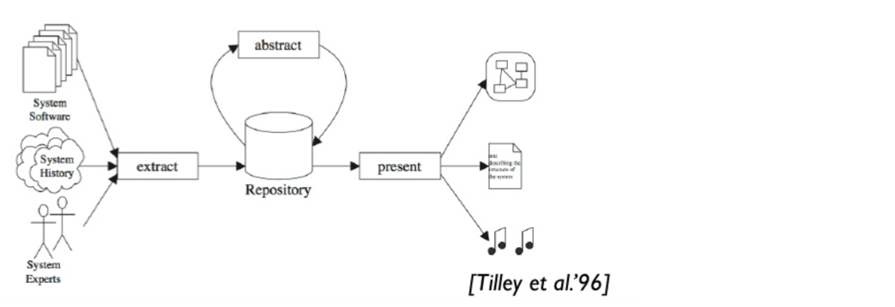

Software Architecture @ ITU
# Session #10: Architecture Reconstruction 

Mircea Lungu

Apr 15, 2021

# Meta

- This and following three lectures
 - Are quite new material
 - Influenced by past student feedback
 - Have inspired several of your colleagues to choose thesis projects
 
 
- Feedback
 - Anonymous: https://forms.gle/ADWfDZdKfPwdFG1D6
 - Email: mlun@itu.dk
 - PR on the GitHub version of the slides (besides the .pdf on learnit)
 
 
- Any questions:
 - Real Time: in the chat window of Zoom
 - LearnIT forum: questions of potential relevance for everybody
 - Email: mlun@itu.dk
 

# Architecture Reconstruction (AR)

> The process of obtaining a (partially) documented architecture for an existing system

> A reverse engineering approach that aims at reconstructing viable architectural views of
a software application (Ducasse & Pollet)
__ 

Synomym: Architecture Recovery

Ducasse & Pollet. *Software Architecture Reconstruction:
a Process-Oriented Taxonomy* (https://rmod.inria.fr/archives/papers/Duca09c-TSE-SOAArchitectureExtraction.pdf)

## Motivation - #1: Many tasks in SE need architectural documentation
 - Adoption
 - Refactoring 
 - Reengineering
 - Understanding
 - Coding
 - Risk assessment for security
 - Architectural Evaluation

 

 

## Motivation - #2 Often Architectural Documentation is Missing or Obsolete

- Have you seen architectural documentation for every system?

Discussions:
- Why is it missing? 
- Why is it obsolete? 
  

## Why is Architectural Documentation Often Obsolete?

 - it's hard to maintain
 - link (traceability ) between architecture and code is often not obvious
 - no perceived value for the customer
 - because people make changes that are not aligned (**architectural drift**)
   - possible solution: enforcing architectural constraints 
     - special DSL for architecture constraints definition
     - implemented as Unit Tests  

# What Happens When Developers Are Not Aware of Architecture?

e.g. possible scenario of dev not being aware of architecture => architectural anti-pattern.

 

## What to Do? 

- reading the code? ArgoUML vs. War and Peace

- **Reverse Reengineering** -- a general process for making sense of code bases
- **Reengineering** -- reverse engineering + restructuring
- **Architecture recovery** -- Specific method: **Symphony** 

# Reverse Engineering & Reengineering

> “Reverse Engineering is the process of analyzing a subject system to identify the system’s components and their interrela- tionships and create representations of the system in another form or at a higher level of abstraction.”

> “Reengineering ... is the examination and alteration of a subject system to reconstitute it in a new form and the subsequent im- plementation of the new form.”

(Demeyer et al., Object Oriented Reengineering Patterns,http://scg.unibe.ch/download/oorp/OORP.pdf)

# Symphony: A Process for Reconstruction

- By van Deursen et al.
- Recovers views and viewpoints as in IEE 1471 / 3+1
- Distinguishes between three kinds of views:
    1. Source 
     - view extracted from artifacts of a sytem
     - not necessarily architectural (e.g. AST)
    1. Target  
     - describes architecture-as-implemented
     - any of the 3+1 views
    1. Hypothetical 
     - architecture-as-designed
     - existing documentation
     - presentations

## Symphony Stages: Design (blue) & Execution (yellow)

## Symphony: Design

Problem elicitation
- “Business case” for reconstruction
- What is the problem? 

Concept determination
- What architectural information is needed to solve the problem?
- Which viewpoints are relevant?

## Symphony: Execution

Data gathering
 - collecting and extracting low-level source views
 - can involve a multitude of sources
 
 
Knowledge inference
 - going from source to target views
 - abstracting low-level information
 
 
Information interpretation 
 - analysis, creating new documentation

# Meta-Architecture of Architecture Recovery Tools

### Extract-Abstract-Present

    Extract = data gathering

    Abstract = knowledge inference

    Present = information interpretation

## [Hands On - Basic Data Gathering](https://github.com/mircealungu/itu-architecture-reconstruction/blob/master/materials/code/Data_Gathering_Intro.ipynb)

# Individual Assignment

Goal is to 
- recover the architecture of an existing system
- document the process and the outcome in an individual report

Reports are: 
 - due in Week TBD
 - submittable one week before for feedback

Tools 
- are important for recovery
- **if you can program**, then this is your chance to be coding **analysis tools** over the upcoming lectures
  - you can still code as a team! (you only have to write the analysis on your own)
- **if you can't program**, then you'll have to find third party tools (the time the programming ones spend on programming, you'll be spending on finding third party tools) 

# Individual Assignment (contd.)

### Case-Study Systems

- The [Zeeguu Project](https://zeeguu.com): 
  - [Zeeguu-API](https://github.com/zeeguu-ecosystem/Zeeguu-API)
  - [Zeeguu-React](https://github.com/zeeguu-ecosystem/zeeguu-react) 
  - invite code: zeeguu-beta
  - a [paper](https://github.com/zeeguu-ecosystem/CHI18-Paper/blob/master/!AsWeMayStudy--Preprint.pdf) about the system
- You can analyze another system of a comparable complexity
  - confirm with me or the TAs about the appropriateness of the system

 
 

# For Next Week

  
  
- (Watch the [live coding session of last year](https://app.vidgrid.com/view/qs3vPcPnjnKT?autoplay=1&t=3751.587316)), try to replicate it, [submit questions about it](https://forms.gle/bsxyKVNfm2LdHaMm7)

- Read 
  - (today's) [Symphony paper](https://www.informatik.uni-bremen.de/st/papers/symphony-wicsa04.pdf) and if something is not clear [write questions about it](https://forms.gle/bsxyKVNfm2LdHaMm7)
  - (next time) [What Architects Should Know About Reverse Engineering and Rengineering](https://www.informatik.uni-bremen.de/st/papers/keynote-wicsa05.pdf)
  - (next time) [Reflexion Models paper](http://www.cs.kent.edu/~jmaletic/cs63902/Papers/Murphy95.pdf) 

